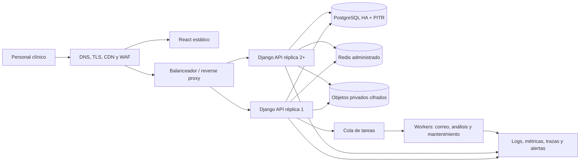

# Preparación para producción y escalabilidad

## Propósito

Este documento es la fuente de verdad para llevar **Sistema Clínico Dental** desde su estado actual de desarrollo hasta una operación productiva segura, recuperable y escalable. Define la arquitectura objetivo, los controles obligatorios, la evidencia necesaria y las puertas de aprobación. No sustituye la revisión jurídica, clínica ni de seguridad independiente.

La aplicación trata datos personales sensibles y expedientes clínicos. Por esa razón, el criterio de salida no es solamente que la aplicación funcione: también debe demostrar confidencialidad, integridad, disponibilidad, trazabilidad y capacidad de recuperación.

## Estado de referencia

La revisión del 28 de agosto de 2026 confirmó:

- 126 pruebas backend aprobadas.
- 130 pruebas frontend aprobadas usando un runtime Node configurado con almacenamiento web.
- `npm run lint`, `npm run build` y `makemigrations --check --dry-run` aprobados.
- `npm audit` sin vulnerabilidades conocidas en ese momento.
- Siete advertencias de `manage.py check --deploy` por configuración de desarrollo.
- SQLite, archivos locales, JWT en Web Storage, ausencia de paginación global y ausencia de auditoría clínica completa.

El sistema se considera un MVP funcional. No está autorizado para almacenar expedientes reales hasta que todas las puertas **P0** de este documento estén cerradas.

## Objetivos de servicio iniciales

Estos valores convierten “escalable” y “disponible” en criterios comprobables. El propietario del producto y operaciones pueden elevarlos mediante una decisión arquitectónica, pero no reducirlos sin aceptar el riesgo por escrito.

| Indicador | Objetivo inicial |
| --- | ---: |
| Disponibilidad mensual de API y aplicación | 99.9 % |
| Latencia p95 de lecturas API | menor de 500 ms |
| Latencia p95 de escrituras API | menor de 800 ms |
| Tasa de respuestas 5xx | menor de 1 % en ventanas de 5 minutos |
| Recuperación de datos, RPO | 15 minutos o menos |
| Recuperación del servicio, RTO | 2 horas o menos |
| Sesiones autenticadas concurrentes validadas | 200 |
| Carga sostenida validada | 50 solicitudes por segundo durante 30 minutos |
| Pico validado | 100 solicitudes por segundo durante 1 minuto |
| Conjunto de prueba | 100 000 pacientes, 1 000 000 de citas/consultas y metadatos de 1 TB de documentos |

El almacenamiento binario no debe cargarse dentro de la prueba transaccional completa. Se valida por separado con archivos sintéticos y límites de ancho de banda.

## Arquitectura objetivo

### Decisiones estructurales

- Servir frontend y API bajo el mismo sitio, por ejemplo `https://clinica.example/api/`, reduce complejidad de CORS, cookies y CSRF. Si se usan dominios distintos, la política de cookies y orígenes debe probarse explícitamente.
- Ejecutar Django como contenedor Linux inmutable mediante un servidor WSGI de producción. `manage.py runserver` queda prohibido.
- Mantener las réplicas web sin estado local. Ninguna sesión, archivo, caché o tarea pendiente puede depender del disco del contenedor.
- Usar PostgreSQL administrado con alta disponibilidad, cifrado, copias automáticas y recuperación a un punto en el tiempo.
- Usar Redis administrado para caché compartida, throttling y coordinación. Nunca usar `LocMemCache` con varias réplicas.
- Guardar documentos y avatares en un bucket privado con cifrado, versionado y bloqueo de acceso público.
- Procesar correo, análisis antimalware, miniaturas, exportaciones y mantenimiento mediante workers idempotentes.
- Desplegar al menos dos réplicas API en producción; staging puede operar con una.

### Equivalencias de infraestructura

| Capacidad | AWS | Azure | Google Cloud | Alternativa independiente |
| --- | --- | --- | --- | --- |
| Contenedores | ECS/Fargate o EKS | Container Apps o AKS | Cloud Run o GKE | Kubernetes administrado |
| PostgreSQL | RDS/Aurora PostgreSQL | Azure Database for PostgreSQL | Cloud SQL/AlloyDB | PostgreSQL administrado |
| Redis | ElastiCache | Azure Managed Redis | Memorystore | Redis administrado |
| Objetos privados | S3 | Blob Storage | Cloud Storage | S3 compatible |
| Secretos | Secrets Manager | Key Vault | Secret Manager | Vault |
| CDN/WAF | CloudFront/WAF | Front Door/WAF | Cloud CDN/Cloud Armor | CDN/WAF administrado |
| Observabilidad | CloudWatch/X-Ray | Azure Monitor | Cloud Monitoring/Trace | OpenTelemetry + proveedor SaaS |

La región debe decidirse después de revisar residencia y transferencia internacional de datos. No se debe seleccionar proveedor solamente por precio.

## Puertas P0: obligatorias antes de datos reales

### P0.1 Gobierno, legal y clínica

- [ ] Nombrar propietario del sistema, responsable clínico, responsable de privacidad, responsable de seguridad y responsable de operaciones.
- [ ] Obtener dictamen jurídico documentado sobre Ley N.° 787, Ley General de Salud N.° 423, su Reglamento y la Norma MINSA N-004 vigente.
- [ ] Registrar o autorizar los ficheros de datos cuando la autoridad y la clasificación jurídica aplicable lo exijan.
- [ ] Aprobar inventario de datos: campo, finalidad, base jurídica, quién accede, ubicación, retención y destino final.
- [ ] Aprobar aviso de privacidad y textos de consentimiento, incluyendo tratamiento de datos de salud, fotografías y documentos.
- [ ] Definir procedimientos para acceso, rectificación, bloqueo, oposición, portabilidad si aplica y cancelación compatible con la conservación médico-legal.
- [ ] Aprobar una matriz de retención. Ingeniería no debe inventar el plazo de conservación del expediente clínico.
- [ ] Firmar contratos de encargado de tratamiento y confidencialidad con nube, correo, monitoreo, soporte y cualquier tercero con acceso.
- [ ] Revisar transferencias internacionales y región de almacenamiento antes de contratar servicios.
- [ ] Capacitar y registrar aceptación de confidencialidad para todo usuario con acceso al sistema.

### P0.2 Configuración segura

- [ ] Separar `development`, `test`, `staging` y `production`; cada entorno usa cuentas, bases, buckets, claves y dominios independientes.
- [ ] Obtener `SECRET_KEY`, credenciales, DSN y claves desde un gestor de secretos. La aplicación debe fallar al iniciar si falta una variable obligatoria.
- [ ] Configurar `DEBUG=False`, `ALLOWED_HOSTS`, `CSRF_TRUSTED_ORIGINS` y CORS mediante variables validadas.
- [ ] Forzar HTTPS y configurar `SECURE_SSL_REDIRECT`, `SECURE_PROXY_SSL_HEADER`, HSTS, cookies `Secure`, `HttpOnly` y `SameSite`.
- [ ] Definir CSP, `Referrer-Policy`, `Permissions-Policy`, `X-Content-Type-Options` y protección contra framing tanto para SPA como API.
- [ ] Ocultar páginas de error y no servir rutas de depuración, media local ni browsable API en producción.
- [ ] Ejecutar `manage.py check --deploy --settings=config.settings.production` sin advertencias no justificadas.

### P0.3 Autenticación y autorización

- [ ] Eliminar refresh tokens de `localStorage` y `sessionStorage`.
- [ ] Guardar el refresh token rotatorio en cookie `HttpOnly`, `Secure`, `SameSite=Lax` o `Strict`, con `Path` limitado al flujo de autenticación; conservar el access token únicamente en memoria.
- [ ] Aplicar CSRF al login, refresh y logout cuando utilicen cookies.
- [ ] Rotar refresh tokens, invalidar el anterior y mantener la validación de `token_version`.
- [ ] Limitar login por IP y cuenta en una capa atómica compartida. El WAF o gateway debe cubrir fuerza bruta y DoS; DRF aporta límites de uso, no sustituye esa protección.
- [ ] Exigir MFA para administradores y recuperación segura de segundo factor. Definir si odontólogos también lo requieren según evaluación de riesgo.
- [ ] Establecer expiración por inactividad, duración máxima de sesión y cierre remoto de sesiones.
- [ ] Registrar login, fallos, logout, refresh, cambio de contraseña, MFA, cambios de rol y denegaciones sin guardar contraseñas ni tokens.
- [ ] Probar cada endpoint con administrador, recepción, odontología, usuario inactivo, sin permiso y recurso de otro alcance.

### P0.4 Integridad del expediente clínico

- [ ] Crear auditoría append-only para lectura y cambio de pacientes, consultas, odontogramas, documentos, citas, usuarios, roles y configuración.
- [ ] Registrar actor, acción, recurso, resultado, fecha UTC, request ID, IP tratada según política, user agent y diff redactado.
- [ ] Impedir `UPDATE` y `DELETE` sobre eventos de auditoría a la cuenta de aplicación; exportarlos además a almacenamiento de logs protegido.
- [ ] Reemplazar modificaciones destructivas de información clínica por correcciones versionadas o enmiendas con motivo y autor.
- [ ] Reemplazar borrado físico inmediato de documentos por estado de eliminación, cuarentena y purga controlada por la matriz de retención.
- [ ] Mantener una sola identidad de paciente con procedimiento de fusión auditable para duplicados legítimos.
- [ ] Aplicar restricciones de base de datos para impedir citas activas solapadas aun bajo concurrencia.

### P0.5 Protección de archivos

- [ ] Migrar avatares, logos y documentos a almacenamiento de objetos; los buckets clínicos deben ser privados y separados por entorno.
- [ ] Aplicar cifrado administrado o con clave del cliente, TLS, versionado, política de ciclo de vida y prohibición de listado público.
- [ ] Validar extensión, MIME, firma real, tamaño y nombre; redecodificar imágenes para eliminar contenido inesperado.
- [ ] Escanear cada archivo con un motor antimalware antes de permitir vista previa o descarga.
- [ ] Mantener archivos nuevos en cuarentena y publicar solamente el resultado limpio.
- [ ] Servir descargas mediante autorización previa y URL firmada de máximo 60 segundos, o mediante proxy autenticado con límites de ancho de banda.
- [ ] Registrar vista previa, descarga, carga, rechazo, eliminación y restauración.
- [ ] Deshabilitar ejecución, contenido activo y renderizado en el mismo origen para PDF o formatos potencialmente peligrosos.

### P0.6 Base de datos y recuperación

- [ ] Migrar SQLite a PostgreSQL mediante ensayo reproducible y comparación de conteos, claves y checksums.
- [ ] Ejecutar PostgreSQL en red privada, sin acceso público, con TLS obligatorio y una cuenta de aplicación sin privilegios administrativos.
- [ ] Habilitar alta disponibilidad y recuperación a un punto en el tiempo con RPO igual o menor a 15 minutos.
- [ ] Cifrar snapshots y réplicas; separar permisos de backup de los permisos de aplicación.
- [ ] Habilitar backups de objetos y versionado independiente del backup de PostgreSQL.
- [ ] Ejecutar una restauración completa en un entorno aislado antes del lanzamiento y cada trimestre.
- [ ] Medir y registrar RPO/RTO real. La existencia de un backup no cuenta como evidencia si no se restauró.

## Escalabilidad de aplicación y API

### Contratos de listado

- Crear `PatientSummarySerializer` sin `clinical_record`, dirección, antecedentes u otros datos que la tabla no necesita.
- Reservar `PatientDetailSerializer` para `/api/patients/{id}/`.
- Paginar pacientes, consultas, citas, documentos y usuarios. El contrato inicial recomendado es `{count, next, previous, results}` con 25 elementos y máximo 100.
- Usar paginación por cursor para líneas temporales grandes e inmutables; usar página o limit/offset cuando la interfaz necesite saltar a una página.
- Crear endpoints mínimos para selector de pacientes, selector de odontólogos y métricas del dashboard.
- Nunca descargar todos los pacientes para contar, mostrar cuatro o llenar un selector. La búsqueda remota debe exigir al menos dos caracteres y limitar resultados.
- Definir límites de fecha obligatorios para listados de citas y consultas operativas.

### Consultas e índices

- Aplicar `select_related` y `prefetch_related` según cada serializador.
- Medir número de consultas en pruebas; los listados deben mantener un número constante al crecer la página.
- Crear índices para filtros reales: estado/fecha de cita, profesional/fecha, paciente/fecha, categorías y marcas temporales.
- Evaluar `pg_trgm` para búsquedas de nombre/correo y conservar `national_id_key` indexado para coincidencia exacta.
- Revisar planes con `EXPLAIN (ANALYZE, BUFFERS)` usando volúmenes equivalentes a producción.
- Configurar límites de conexión y pool administrado. El total de conexiones de todas las réplicas debe quedar por debajo del máximo de PostgreSQL con margen operativo.

### Caché y tareas asíncronas

- Cachear solamente datos compartidos de baja sensibilidad y lectura frecuente: perfil de clínica, horarios, cierres, categorías y servicios.
- No cachear expedientes clínicos completos ni respuestas por usuario sin una clave de autorización explícita.
- Invalidar la caché en el mismo flujo que modifica la configuración.
- Enviar correo, escaneo antimalware, exportaciones y trabajos de mantenimiento a una cola.
- Diseñar tareas idempotentes, con timeout, reintentos con backoff, límite máximo y dead-letter queue.
- No incluir PII, archivos ni tokens en el payload de la cola; enviar identificadores y volver a autorizar al procesar.

### Frontend

- Cargar todas las rutas clínicas y administrativas mediante `lazy`/`Suspense`.
- Reemplazar el logo SVG con PNG embebido por recursos optimizados y responsivos.
- Adoptar una capa de caché/deduplicación de consultas o un patrón común que cancele solicitudes obsoletas.
- Manejar centralmente expiración de sesión, estado offline, errores de red y reintentos seguros.
- Configurar caché larga para assets con hash y `no-store` para HTML, sesión y respuestas clínicas.
- Mantener accesibilidad: `lang="es"`, título real, foco, teclado, contraste y mensajes de estado.

## Observabilidad y operación

### Telemetría

- Logs JSON con timestamp UTC, nivel, servicio, versión, entorno, request ID, trace ID, ruta normalizada, estado, duración y actor interno.
- Prohibir nombres de pacientes, cédulas, diagnósticos, notas, cuerpos HTTP, tokens, cookies y URLs firmadas en logs.
- Propagar `X-Request-ID` desde el proxy hasta Django, workers y servicios externos.
- Métricas mínimas: tráfico, latencia, errores, saturación, conexiones DB, locks, consultas lentas, caché, cola, workers, almacenamiento y autenticación fallida.
- Trazas distribuidas para solicitudes lentas y tareas, con muestreo que no capture contenido clínico.
- Reporte de errores con redacción de PII y alertas agrupadas por versión.

### Alertas

- 5xx mayor de 1 % durante 5 minutos.
- p95 por encima del objetivo durante 10 minutos.
- disponibilidad por debajo del SLO.
- conexiones DB mayores de 80 %, réplica atrasada o backup/PITR fallido.
- dead-letter queue no vacía, tarea más antigua fuera de objetivo o workers ausentes.
- incremento anómalo de logins fallidos, 403, refresh inválido o descargas masivas.
- certificado TLS próximo a vencer, bucket público, secreto próximo a rotación o escaneo antimalware inoperante.
- espacio, costo o crecimiento de datos fuera del presupuesto aprobado.

Cada alerta debe indicar severidad, responsable, canal, ventana, runbook y criterio de cierre.

### Endpoints operativos

- `/health/live`: confirma que el proceso responde; no consulta dependencias.
- `/health/ready`: comprueba base de datos, Redis, bucket y cola con timeouts cortos.
- `/health/version`: expone solamente SHA de commit, versión y fecha de build.
- Los endpoints no deben revelar credenciales, hosts internos, versiones de dependencias ni stack traces.

## Entrega continua e infraestructura como código

### CI requerida

Todo pull request debe ejecutar en entornos limpios:

1. Backend: instalación bloqueada, `check`, migraciones pendientes y 126+ pruebas.
2. Frontend: `npm ci`, 130+ pruebas, lint y build.
3. Auditoría de dependencias Python y npm.
4. Escaneo de secretos, SAST y análisis del contenedor.
5. Generación de SBOM y artefactos firmados por SHA.
6. Pruebas de contrato de API y migraciones desde una copia anonimizada del esquema anterior.

No se deben ejecutar correcciones automáticas de dependencias directamente sobre producción.

### CD requerida

- Construir una sola imagen y promover exactamente el mismo digest por staging y producción.
- Ejecutar migraciones compatibles hacia atrás como un job único antes de cambiar tráfico.
- Desplegar con readiness checks y al menos dos réplicas disponibles.
- Ejecutar smoke tests autenticados con una cuenta sintética sin datos reales.
- Requerir aprobación manual para producción y registrar actor, commit, imagen, migraciones y evidencia.
- Hacer rollback de aplicación por digest. Las migraciones destructivas requieren estrategia expand/contract; nunca depender de revertir datos en caliente.
- Bloquear despliegues cuando backup, observabilidad, escaneo o pruebas de restauración no estén saludables.

### Infraestructura como código

- Versionar redes, reglas, base, Redis, buckets, secretos, identidad, observabilidad y despliegue.
- Exigir revisión de cambios y plan antes de aplicar.
- Usar identidades de workload, no claves permanentes dentro del repositorio o CI.
- Aplicar mínimo privilegio, etiquetas de costo y detección de drift.
- Mantener estado de IaC cifrado, bloqueado y con acceso separado.

## Estrategia de pruebas productivas

### Funcionales y de seguridad

- Unitarias, integración y frontend permanecen como puerta obligatoria.
- E2E cubre login, MFA, permisos, paciente, consulta, odontograma, documento, cita y recuperación de contraseña.
- Matriz negativa verifica IDOR y escalación vertical/horizontal.
- DAST sobre staging y pentest independiente antes de datos reales y después de cambios mayores.
- Evaluación OWASP ASVS 5.0 con evidencia; objetivo mínimo acordado: nivel 2 completo para la aplicación y controles de nivel 3 donde el riesgo clínico lo justifique.
- Escaneo de malware con archivos limpios, EICAR en entorno aislado, formatos engañosos, archivos corruptos y límites.

### Rendimiento

- Sembrar datos sintéticos sin PII con el volumen definido en “Objetivos de servicio”.
- Medir login, búsqueda, dashboard, expediente, agenda diaria/semanal/mensual, historial de odontogramas y metadatos de documentos.
- Validar carga sostenida, pico, soak de 8 horas y recuperación después de saturación.
- Registrar p50, p95, p99, errores, CPU, memoria, conexiones, queries lentas, caché y cola.
- No aprobar si el sistema cumple latencia sacrificando errores, integridad o disponibilidad.

### Resiliencia

- Reiniciar una réplica durante carga sin interrupción visible.
- Simular Redis indisponible y comprobar degradación controlada.
- Simular worker detenido, dependencia de correo caída y escáner antimalware caído.
- Restaurar PostgreSQL a un instante anterior y reconciliar objetos.
- Probar rollback de aplicación y reanudación idempotente de tareas.

## Runbooks obligatorios

Antes del lanzamiento deben existir y haberse ensayado:

- Despliegue y rollback.
- Migración fallida.
- Restauración de PostgreSQL y objetos.
- Rotación y compromiso de secretos.
- Cuenta administrativa comprometida.
- Fuga o acceso indebido a datos clínicos.
- Malware detectado en un archivo.
- Caída de base, Redis, bucket, correo o cola.
- Saturación, consultas lentas y crecimiento inesperado.
- Solicitud de acceso/rectificación/cancelación de un titular.
- Baja de empleado y revocación inmediata de acceso.
- Comunicación de incidente y preservación de evidencia.

Cada runbook incluye disparador, severidad, responsable, pasos, validación, comunicación, evidencia y revisión posterior.

## Puertas de lanzamiento

### Seguridad y cumplimiento

- [ ] Dictamen jurídico y clínico firmado.
- [ ] Inventario, aviso de privacidad, consentimientos y retención aprobados.
- [ ] Threat model y evaluación ASVS cerrados.
- [ ] Pentest sin hallazgos críticos o altos abiertos.
- [ ] MFA administrativo, sesiones seguras, rate limiting y auditoría activos.
- [ ] Archivos privados, cifrados y escaneados.

### Plataforma y datos

- [ ] Producción declarada mediante IaC y separada de staging.
- [ ] PostgreSQL HA/PITR, Redis, objetos privados y cola operativos.
- [ ] Restauración completa dentro de RPO/RTO demostrada.
- [ ] Dos réplicas API y workers sin estado local.
- [ ] Migración de datos ensayada y reconciliada.

### Calidad y rendimiento

- [ ] CI completa en verde sobre el commit candidato.
- [ ] `check --deploy` sin advertencias no aceptadas.
- [ ] E2E, DAST, carga, soak y resiliencia aprobados.
- [ ] Sin consultas N+1 ni endpoints clínicos sin paginación justificada.
- [ ] SLOs y límites de capacidad alcanzados.

### Operación

- [ ] Dashboards, alertas y rotación de guardia activos.
- [ ] Runbooks ensayados y contactos verificados.
- [ ] Soporte, horario, escalamiento y mantenimiento comunicados.
- [ ] Presupuesto y alertas de costo aprobados.
- [ ] Ventana de lanzamiento, rollback y monitoreo intensivo de 72 horas acordados.

El lanzamiento es **NO-GO** si falta cualquiera de estas evidencias P0. Una excepción requiere propietario, justificación, impacto, control compensatorio y fecha de expiración aprobados por escrito.

## Fases recomendadas

1. **Fundación productiva:** settings por entorno, PostgreSQL, contenedores, secretos, mismo origen y CI.
2. **Seguridad clínica:** cookies, MFA, throttling, auditoría, almacenamiento privado y antimalware.
3. **Integridad y escalabilidad:** serializadores mínimos, paginación, endpoints de opciones/métricas, índices y restricciones concurrentes.
4. **Operación:** observabilidad, cola, backups, restore, runbooks, carga, DAST y pentest.
5. **Lanzamiento controlado:** migración ensayada, aprobación, despliegue gradual y vigilancia de 72 horas.

El plan de implementación detallado está en [`docs/superpowers/plans/2026-08-28-production-readiness-and-scalability.md`](superpowers/plans/2026-08-28-production-readiness-and-scalability.md).

## Referencias oficiales

- [Django 5.2: deployment checklist](https://docs.djangoproject.com/en/5.2/howto/deployment/checklist/)
- [Django: performance and optimization](https://docs.djangoproject.com/en/5.2/topics/performance/)
- [Django REST Framework: pagination](https://www.django-rest-framework.org/api-guide/pagination/)
- [Django REST Framework: throttling](https://www.django-rest-framework.org/api-guide/throttling/)
- [OWASP ASVS 5.0](https://owasp.org/www-project-application-security-verification-standard/)
- [OWASP Session Management Cheat Sheet](https://cheatsheetseries.owasp.org/cheatsheets/Session_Management_Cheat_Sheet.html)
- [OWASP Logging Cheat Sheet](https://cheatsheetseries.owasp.org/cheatsheets/Logging_Cheat_Sheet.html)
- [PostgreSQL: Continuous Archiving and Point-in-Time Recovery](https://www.postgresql.org/docs/17/continuous-archiving.html)
- [Nicaragua: Ley N.° 787 de Protección de Datos Personales](https://legislacion.asamblea.gob.ni/normaweb.nsf/9e314815a08d4a6206257265005d21f9/e5d37e9b4827fc06062579ed0076ce1d)
- [Nicaragua: texto consolidado de la Ley General de Salud N.° 423](https://legislacion.asamblea.gob.ni/Normaweb.nsf/xpNorma.xsp?documentId=CD1C66B4256FBCB106258AD7006F1AF0)
- [Nicaragua: Reglamento de la Ley General de Salud](https://legislacion.asamblea.gob.ni/Normaweb.nsf/%28%24All%29/0F963CAE75EBD5DC0625715A005C0DC9)
- [MINSA: Norma N-004 para el manejo del expediente clínico](https://www.minsa.gob.ni/publicaciones/direccion-general-de-regulacion-sanitaria/normativa-004-norma-para-el-manejo-del)
